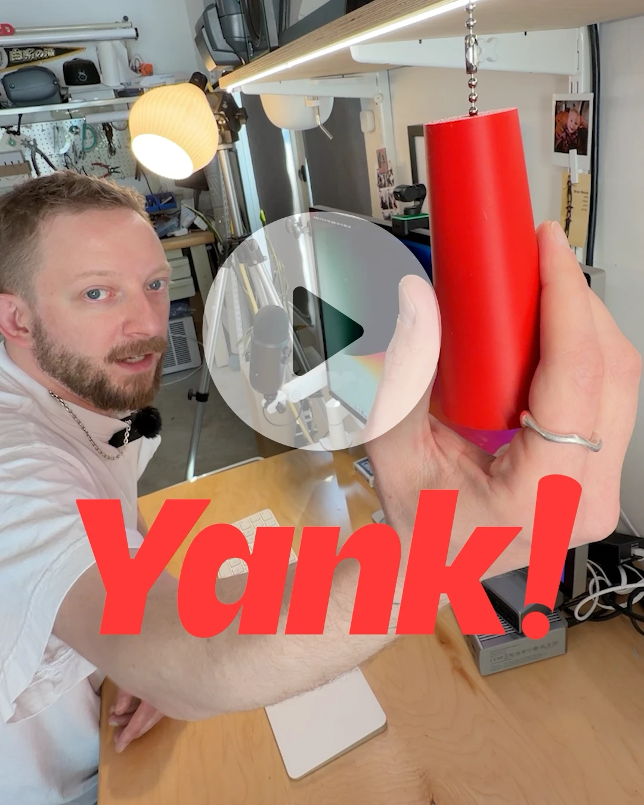

# ***Yank!***

***Yank!*** is a purposeful way to use your computer.

[](https://www.instagram.com/p/DV84M5tjh6s/)

**[Watch video](https://www.instagram.com/p/DV84M5tjh6s/)**

*Disclosure: this video was in partnership with Anthropic.*

## What it does

***Yank!*** is a physical pull switch that connects to your Mac over BLE and triggers configurable actions — play a sound, mute your mic, end a video call, run a script, whatever you want. One pull, instant reaction. More at [yank.computer](https://yank.computer).

## Repo structure

| Folder | Description |
|--------|-------------|
| [`firmware/`](firmware/) | Zephyr/nRF Connect SDK firmware for the XIAO nRF54L15 |
| [`macos-app/`](macos-app/) | ***Yank!*** Companion App — macOS menu bar app (SwiftUI + CoreBluetooth) |
| [`hardware/`](hardware/) | 3D-printable enclosure (STL) and editable model (Fusion) |
| [`website/`](website/) | Landing page at yank.computer |

## Features

- Play a sound
- Play/pause music
- Press key commands
- Mute/unmute audio
- Mute/unmute microphone
- Display a notification
- Run a custom script
- End video calls (Zoom, Meet, FaceTime, Teams)
- Whatever you want (given that you're willing to make it happen!)

## Hardware

| Component | Detail |
|-----------|--------|
| Board | [Seeed XIAO nRF54L15](https://wiki.seeedstudio.com/xiao-nrf54l15/) |
| Switch | [Single Circuit Pull Chain Switch](https://www.homedepot.com/p/Gardner-Bender-3-Amp-Single-Pole-Single-Circuit-Pull-Chain-Switch-Nickel-1-Pack-GSW-31/100126308) (Most companies sell the same exact one) |
| Power | [100mAh LiPo battery](https://www.amazon.com/dp/B0CNLNHK4F?th=1) via XIAO battery connector |

See [`firmware/README.md`](firmware/README.md) for BLE protocol details, pin assignments, and LED patterns.

## Building — Firmware

### Prerequisites

- [nRF Connect SDK v2.9.0](https://developer.nordicsemi.com/nRF_Connect_SDK/doc/latest/nrf/installation.html) installed at `~/ncs`
- `west` meta-tool
- Zephyr SDK toolchain (arm-zephyr-eabi)

### Build & flash

```bash
cd firmware
export ZEPHYR_BASE=~/ncs/zephyr

west build -b xiao_nrf54l15/nrf54l15/cpuapp --build-dir build
```

Flash via UF2: double-press reset, then copy the UF2 to the mounted drive:

```bash
python3 ~/ncs/zephyr/scripts/build/uf2conv.py build/firmware/zephyr/zephyr.hex \
  -c -f 0x00000000 -o yank.uf2
cp yank.uf2 /Volumes/XIAO-SENSE/
```

Or flash via J-Link: `west flash --build-dir build`

## ***Yank!*** Companion App (macOS)

**[Download the latest release (DMG)](https://github.com/lanewinfield/yank/releases/latest)**

### Building from source

#### Prerequisites

- macOS 13.0+
- Xcode 15.0+

#### Build

```bash
cd macos-app
xcodebuild -project YankCompanion.xcodeproj -scheme YankCompanion -configuration Release build
```

The built app lands in `~/Library/Developer/Xcode/DerivedData/YankCompanion-*/Build/Products/Release/Yank Companion.app`.

## License

[CC BY-NC-SA 4.0](LICENSE) — free to use and remix with attribution, non-commercial, share-alike.

---

Made by [Brian Moore](https://brianmoore.com) (w/ plenty of assist from [Claude](https://claude.ai))

*Disclosure: the [video](https://www.instagram.com/p/DV84M5tjh6s/) featured in this README was made in partnership with Anthropic.*
